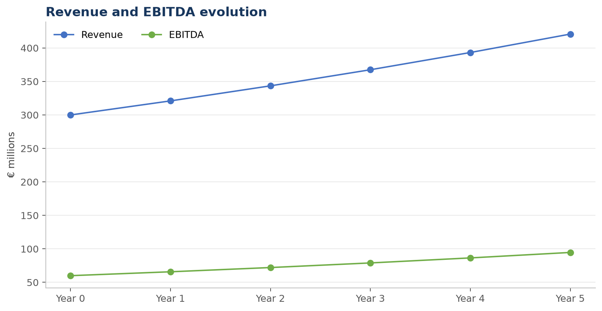
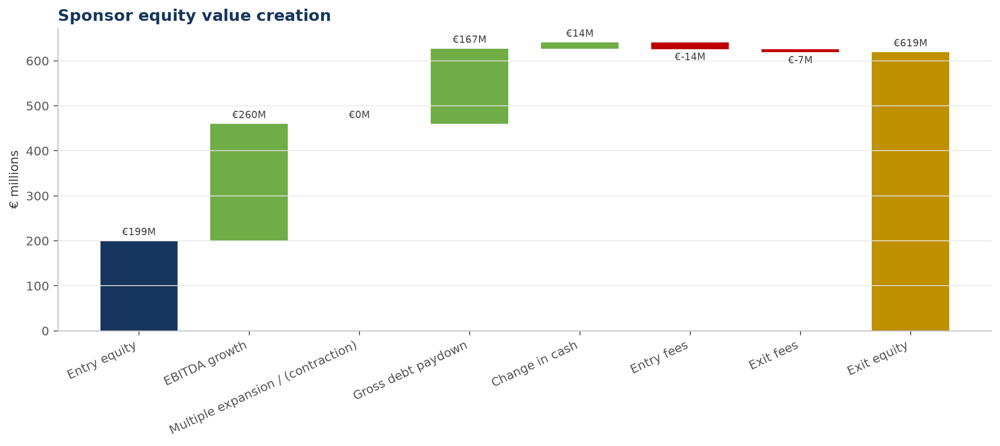
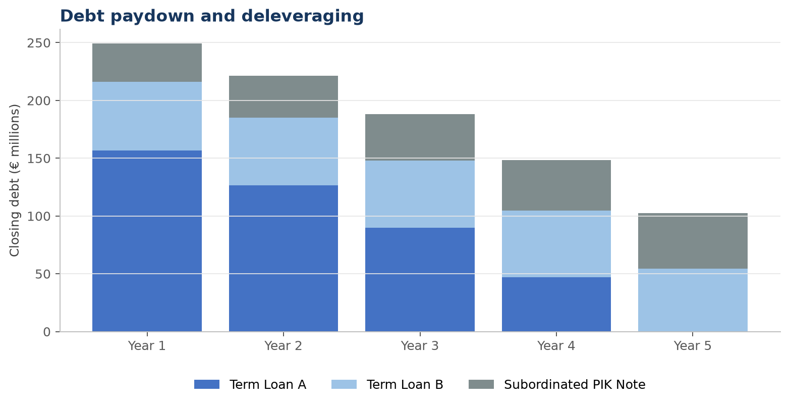
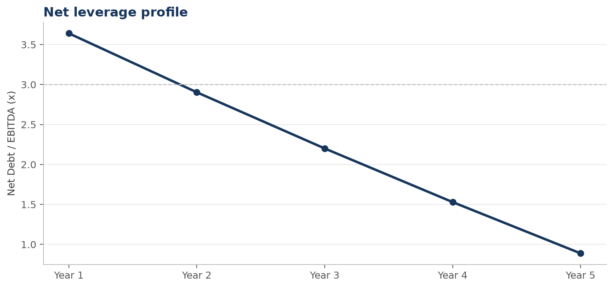
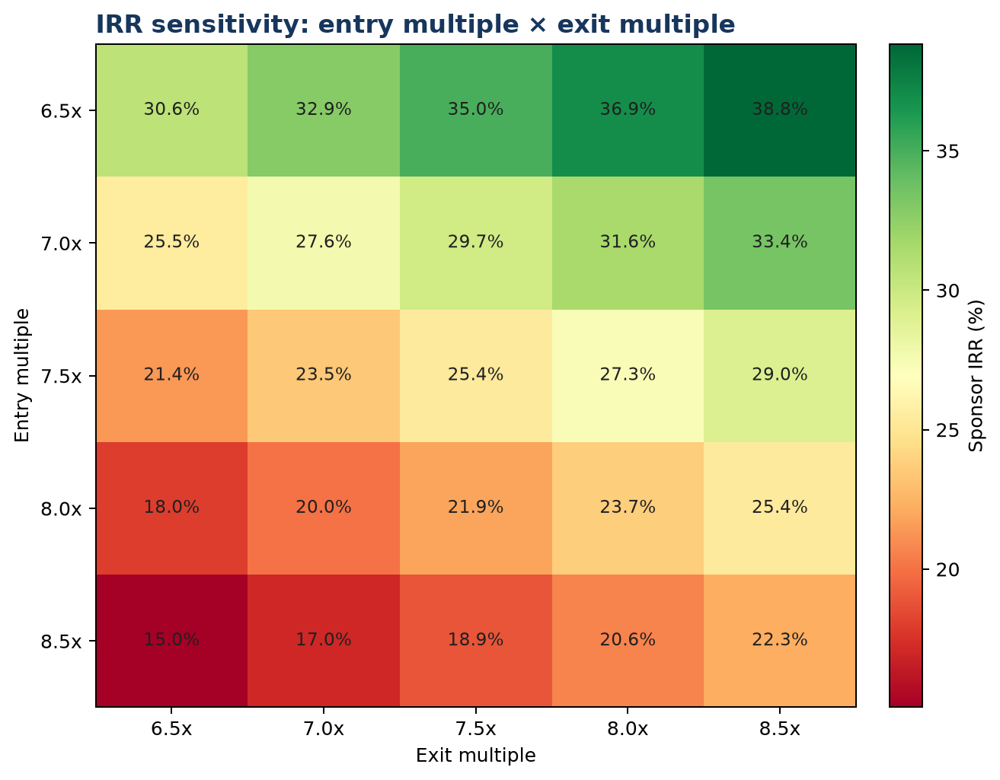

# LBO Investment Model

A transparent Python and Excel leveraged buyout model for a fictional European industrial components distributor. The case connects operating performance, cash conversion, debt repayment and exit valuation to sponsor returns across Bear, Base and Bull scenarios.

## Investment Case

Northstar Components is a fictional distributor serving recurring maintenance and replacement demand across fragmented industrial end markets. The underwriting case assumes that revenue growth, measured margin improvement and disciplined cash conversion can reduce leverage while preserving strategic flexibility.

The central risks are slower end-market growth, failure to deliver margin improvement, PIK accumulation and exit-multiple contraction. The model therefore holds the entry capital structure constant across scenarios and changes operating performance, exit valuation and the cash-sweep percentage.

## Transaction Overview

All amounts are fictional and shown in EUR.

| Metric | Amount |
|---|---:|
| Entry Revenue | €300.0M |
| Entry EBITDA | €60.0M |
| Entry EBITDA Margin | 20.0% |
| Entry Multiple | 7.5x |
| Entry Enterprise Value | €450.0M |
| Initial Gross Debt | €270.0M |
| Initial Gross Leverage | 4.5x |
| Sponsor Equity | €199.4M |

Sources & Uses includes €9.0M of transaction fees, €5.4M of financing fees and €5.0M of minimum cash. Debt comprises a €180.0M Term Loan A, a €60.0M Term Loan B and a €30.0M subordinated PIK note.

## Operating Case

| Assumption | Bear | Base | Bull |
|---|---:|---:|---:|
| Annual Revenue Growth | 3.0% | 7.0% | 10.0% |
| Annual EBITDA Margin Expansion | 0 bps | 50 bps | 75 bps |
| Exit EBITDA Margin | 20.0% | 22.5% | 23.8% |
| Exit Multiple | 6.5x | 7.5x | 8.5x |
| Cash Sweep | 50% | 75% | 100% |

The common operating assumptions are D&A at 4.0% of revenue, CapEx at 3.0% of revenue, NWC at 15.0% of revenue and a 28.0% cash tax rate. Change in NWC is calculated from the annual NWC balance rather than as a percentage of total revenue.



## Value Creation

The Base Case increases sponsor equity value from €199.4M at entry to €618.9M at exit.

| Component | Contribution |
|---|---:|
| EBITDA Growth | €260.0M |
| Multiple Expansion / (Contraction) | €0.0M |
| Gross Debt Paydown | €167.4M |
| Change in Cash | €13.6M |
| Entry and Exit Fees | (€21.5M) |

The value-creation bridge reconciles to exit sponsor equity. With the Base Case exit multiple equal to the entry multiple, returns are driven by EBITDA growth and deleveraging rather than multiple expansion.



## Returns

| Scenario | Exit EBITDA | Exit Equity Value | Debt Paydown | Exit Net Leverage | MOIC | IRR |
|---|---:|---:|---:|---:|---:|---:|
| Bear | €69.6M | €324.8M | €117.7M | 1.77x | 1.63x | 10.3% |
| Base | €94.7M | €618.9M | €167.4M | 0.89x | 3.10x | 25.4% |
| Bull | €114.7M | €909.8M | €209.2M | 0.49x | 4.56x | 35.5% |

IRR assumes one sponsor outflow at entry, no interim dividends and one realization at exit.

## Deleveraging

The debt schedule calculates cash interest on average pre-sweep balances, mandatory amortization by tranche, PIK interest on opening principal and an end-of-year cash sweep. The PIK note grows from €30.0M to €48.3M in the Base Case while cash-pay debt is reduced more quickly.

| Base Case | Year 1 | Year 2 | Year 3 | Year 4 | Year 5 |
|---|---:|---:|---:|---:|---:|
| Gross Debt | €249.3M | €221.5M | €188.0M | €148.6M | €102.6M |
| Closing Cash | €9.7M | €12.1M | €14.2M | €16.3M | €18.6M |
| Net Debt | €239.6M | €209.4M | €173.8M | €132.3M | €84.1M |
| Net Debt / EBITDA | 3.64x | 2.90x | 2.20x | 1.53x | 0.89x |





## Sensitivities

The model re-runs operating cash flow, debt paydown and exit returns for each sensitivity cell. It includes:

- Entry Multiple × Exit Multiple sensitivity for IRR
- Exit Multiple × Exit EBITDA CAGR sensitivity for IRR
- Holding period sensitivity from three to seven years



## Model Architecture

| Module | Responsibility |
|---|---|
| `model/assumptions.py` | Entry, operating, debt and scenario assumptions |
| `model/operating_model.py` | Revenue, EBITDA, D&A, EBIT, CapEx and NWC projection |
| `model/debt.py` | Sources & Uses, cash interest, PIK, amortization and cash sweep |
| `model/returns.py` | Exit equity bridge, MOIC, IRR and value creation |
| `model/sensitivity.py` | Return sensitivities with full model recalculation |
| `model/excel_export.py` | Six-sheet professional Excel workbook |
| `model/charts.py` | README and presentation chart assets |
| `model/engine.py` | Model orchestration and financial consistency checks |

The Python model is the source of truth. The Excel workbook is generated from the same calculated schedules and contains `Summary`, `Assumptions`, `Operating Model`, `Debt Schedule`, `Returns` and `Sensitivities` sheets.

## How to Run

```bash
python -m venv .venv
source .venv/bin/activate
pip install -r requirements.txt
python lbo_model.py
pytest
```

The command generates:

- `outputs/LBO_Investment_Model.xlsx`
- Six charts in `assets/`

## Model Checks

The model reports explicit checks for Sources = Uses, entry EV, initial debt sizing, debt roll-forwards, non-negative debt balances, the FCF bridge, cash roll-forward, exit EV to equity value and scenario consistency. The generated Base Case passes all nine checks.

## Limitations

The transaction and company are entirely fictional. This project is an analytical and portfolio exercise and does not represent transaction experience, investment advice or a production underwriting model.

The model does not include a full three-statement balance sheet, purchase accounting, tax-loss carryforwards, a revolver draw, management incentive dilution or interim sponsor distributions. PIK interest is assumed tax-deductible, mandatory amortization occurs during the year, and the cash sweep occurs at year-end. Cash interest uses average pre-sweep debt to avoid a circular reference. Any real underwriting case would require diligence-backed operating drivers, legal debt terms and jurisdiction-specific tax analysis.

## Author

**Wilfried LAWSON HELLU**

Finance × Data × Software
